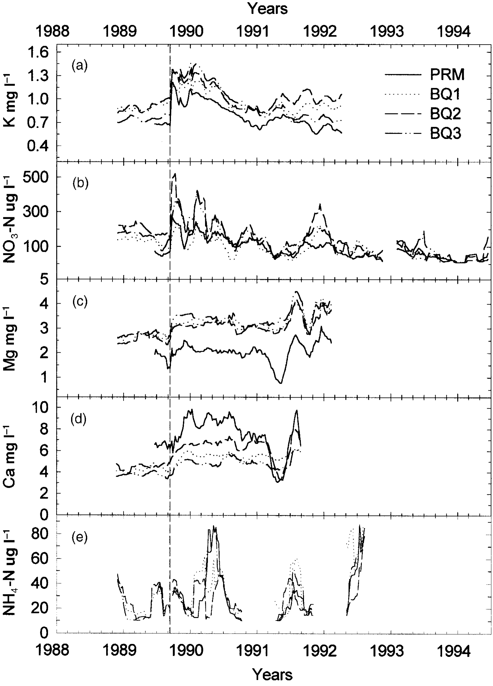

# Hurricane effects on stream chemistry: Figure 3 recreation
Emalia Partlow (EDS 214)

# Background

**Repository purpose:** Contains the raw data, cleaned data, functions, and scripts used to replicate Figure 3 from [Schaefer et al. (2000)](https://doi.org/10.1017/s0266467400001358)

**Figure 3 overview:** Concentrations of 5 nutrients from 4 stream sites in Puerto Rico, before and after Hurricane Hugo in 1989



# Data

* **data/** contains the raw data folder, **knb-lter-luq.20.4923064**, from [McDowell and International Institute Of Tropical Forestry (IITF) (2024)](https://doi.org/10.6073/PASTA/F31349BEBDC304F758718F4798D25458)

* For more information on the contents of **data/knb-lter-luq.20.4923064**, see **data/README.md**

* **1_clean_data.R** includes the code for cleaning the raw data, creating **fig3_long.csv** in **output/**, which is ready for analysis

# Methods

* Figure 3 from [Schaefer et al. (2000)](https://doi.org/10.1017/s0266467400001358) was recreated by plotting a 9 week moving average time series of nutrient concentrations for each target site

* For a more detailed work flow, see **README.md**

# Results

```{r}

library(tidyverse)

fig3_long <- read_csv("../output/fig3_long.csv")
```
```{r}

ggplot(
  data = fig3_long,
  mapping = aes(x = window_start, y = concentration, linetype = Sample_ID)
) +
  geom_line() +
  geom_vline(xintercept = ymd("1989-09-18"), linetype = 2) +
  theme_bw() +
  theme(
    panel.grid.major = element_blank(),
    panel.grid.minor = element_blank(),
    legend.title = element_blank(),
    legend.position = "inside",
    legend.justification = c("right", "top"),
    legend.key.height = unit(.4, "cm"),
    legend.key.width = unit(.5, "cm"),
    strip.placement = "outside"
  ) +
  labs(x = "Years", y = "") +
  scale_x_date(sec.axis = dup_axis()) +
  facet_grid(nutrients ~ ., scales = "free_y", switch = "y")
```

# References

McDowell, William H., and USDA Forest Service. International Institute Of Tropical Forestry (IITF). 2024. “Chemistry of Stream Water from the Luquillo Mountains.” Environmental Data Initiative. [https://doi.org/10.6073/PASTA/F31349BEBDC304F758718F4798D25458](https://doi.org/10.6073/PASTA/F31349BEBDC304F758718F4798D25458).

Schaefer, Douglas. A., William H. McDowell, Fredrick N. Scatena, and Clyde E. Asbury. 2000. “Effects of Hurricane Disturbance on Stream Water Concentrations and Fluxes in Eight Tropical Forest Watersheds of the Luquillo Experimental Forest, Puerto Rico.” *Journal of Tropical Ecology* 16 (2): 189–207. [https://doi.org/10.1017/s0266467400001358](https://doi.org/10.1017/s0266467400001358).